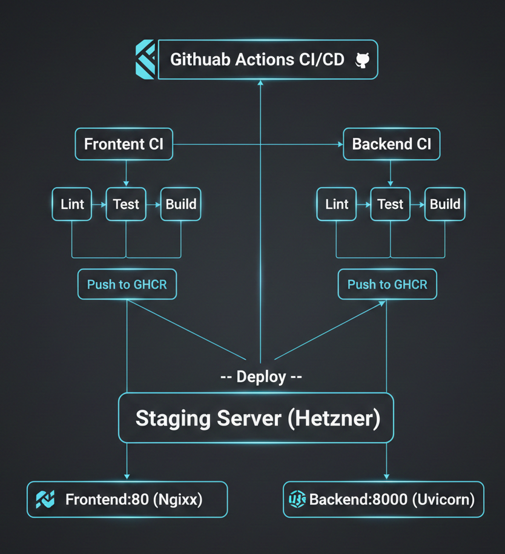

# Microservices CI/CD Pipeline

[](https://github.com/pedramnj/react-fastapi-docker/actions/workflows/frontend-ci.yml)
[](https://github.com/pedramnj/react-fastapi-docker/actions/workflows/backend-ci.yml)

A production-ready CI/CD pipeline featuring a React frontend and FastAPI backend, containerized with Docker and deployed via GitHub Actions with HTTPS, monitoring, and infrastructure as code.

## Architecture



## Tech Stack

| Component | Technology |
|-----------|------------|
| Frontend | React 19, Vite, TypeScript |
| Backend | FastAPI, Python 3.12, Uvicorn |
| Containerization | Docker, Docker Compose |
| CI/CD | GitHub Actions |
| Registry | GitHub Container Registry (ghcr.io) |
| Server | Ubuntu 22.04 (ARM64) |

## Project Structure

```
.
├── .github/workflows/
│   ├── frontend-ci.yml      # Frontend pipeline
│   ├── backend-ci.yml       # Backend pipeline
│   └── deploy-all.yml       # Full deployment
├── frontend/
│   ├── src/                 # React source code
│   ├── Dockerfile           # Multi-stage Docker build
│   └── nginx.conf           # Nginx configuration
├── backend/
│   ├── app/                 # FastAPI application
│   ├── tests/               # Pytest tests
│   └── Dockerfile           # Multi-stage Docker build
├── docker-compose.yml       # Local development
└── docker-compose.staging.yml  # Staging deployment
```

## Quick Start

### Local Development

```bash
# Clone the repository
git clone https://github.com/pedramnj/react-fastapi-docker.git
cd react-fastapi-docker

# Start all services
docker compose up -d

# Access the applications
# Frontend: http://localhost:3000
# Backend: http://localhost:8000
# API Docs: http://localhost:8000/docs
```

### Run Tests

```bash
# Frontend tests
cd frontend && npm run test:run

# Backend tests
cd backend && pip install -r requirements-dev.txt && pytest
```

## CI/CD Pipeline

### Pipeline Stages

1. **Lint**: Code quality checks (ESLint for frontend, Ruff for backend)
2. **Test**: Unit tests with coverage reporting
3. **Build**: Multi-stage Docker image build
4. **Push**: Push images to GitHub Container Registry
5. **Deploy**: SSH deployment to staging server

### Triggers

- **Frontend CI**: Push/PR to `main` with changes in `frontend/`
- **Backend CI**: Push/PR to `main` with changes in `backend/`
- **Deploy All**: Manual trigger or changes to `docker-compose.staging.yml`

## API Endpoints

| Endpoint | Method | Description |
|----------|--------|-------------|
| `/` | GET | API root, returns status |
| `/health` | GET | Health check endpoint |
| `/api/info` | GET | Application information |
| `/api/items` | GET | Sample data endpoint |
| `/docs` | GET | Swagger UI documentation |

## Deployment

### Server Requirements

- Ubuntu 22.04+
- Docker and Docker Compose
- UFW firewall (ports 22, 80, 443, 8000)
- Dedicated deploy user with Docker access

### Manual Deployment

```bash
# SSH to server
ssh deploy@37.27.25.159

# Navigate to app directory
cd /opt/devops

# Pull latest images
docker compose -f docker-compose.staging.yml pull

# Deploy
docker compose -f docker-compose.staging.yml up -d
```

### Environment Variables

| Variable | Description | Default |
|----------|-------------|---------|
| `VITE_API_URL` | Backend API URL (frontend) | `http://localhost:8000` |
| `DEBUG` | Debug mode (backend) | `false` |
| `CORS_ORIGINS` | Allowed CORS origins (backend) | `http://localhost:3000` |

## GitHub Secrets

Required secrets for CI/CD:

| Secret | Description |
|--------|-------------|
| `SSH_PRIVATE_KEY` | SSH key for server access |
| `STAGING_HOST` | Staging server IP address |
| `STAGING_USER` | SSH user for deployment |

## Documentation

- [Architecture Details](docs/ARCHITECTURE.md)
- [Setup Guide](docs/SETUP.md)
- [Deployment Guide](docs/DEPLOYMENT.md)

## License

MIT License

## Author

Pedram Nikjooy - DevOps Portfolio Project
